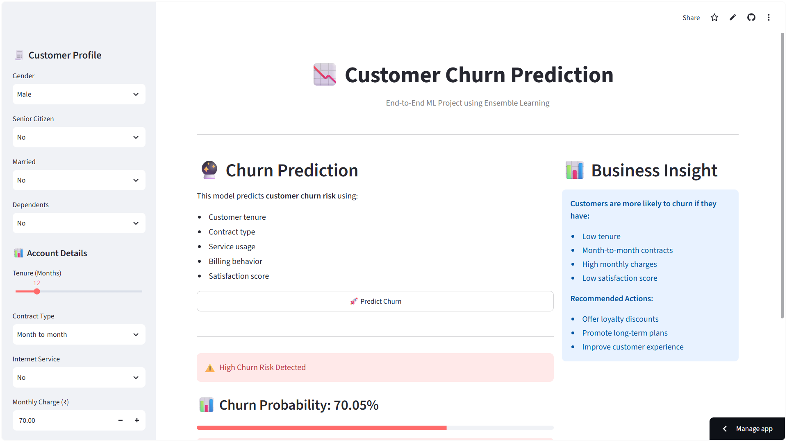

# 📉 Customer Churn Prediction System

<div align="center">

[](https://churnmodel-by-vishal-dubey.streamlit.app/)
[](https://www.python.org/)
[](https://scikit-learn.org/)

An **end-to-end, production-ready Machine Learning system** designed to predict customer churn in subscription-based businesses such as **Telecom, SaaS, and Banking**.

[🚀 **Access Live Web Application**](https://churnmodel-by-vishal-dubey.streamlit.app/)

---

### 🖥️ Application Preview

<a href="https://churnmodel-by-vishal-dubey.streamlit.app/">
  
</a>

*Live Interactive Web Dashboard deployed on Streamlit Cloud*

</div>

---

## 🔗 Live Application Link

> 🌐 **Live Web App:** [https://churnmodel-by-vishal-dubey.streamlit.app/](https://churnmodel-by-vishal-dubey.streamlit.app/)

Click the link above to access the live app, adjust customer profile parameters, predict churn risk probabilities in real-time, and view tailored business retention recommendations.

---

## 🚀 Project Overview

Customer churn directly impacts business revenue. Failing to identify churn-prone customers leads to **significant financial loss**, while timely detection enables **proactive retention strategies**.

### 🎯 Objective
Predict whether a customer will **churn (1) or stay (0)**, enabling businesses to take **data-driven retention actions** before losing valuable accounts.

---

## 🧠 Key Highlights

- ✅ **End-to-End ML Pipeline:** Complete flow from raw data EDA to interactive web deployment.
- ✅ **Data Leakage Prevention:** Removed post-churn features like total charges and location noise to ensure high real-world accuracy.
- ✅ **Class Imbalance Management:** Handled ~26% baseline churn distribution effectively.
- ✅ **Recall-Optimized:** Prioritized high recall for churners to minimize costly false negatives.
- ✅ **Ensemble Learning:** Utilized a **Soft Voting Classifier** combining Logistic Regression, Random Forest, and Gradient Boosting.
- ✅ **Interactive Dashboard:** Built with **Streamlit** offering real-time prediction sliders, risk badges, and business suggestions.

---

## 🧩 Solution Strategy

The project follows a structured, industry-aligned ML workflow:

1. **Exploratory Data Analysis (EDA):** Deep dive into customer demographics, contract types, and billing behaviors.
2. **Hypothesis Testing:** Validated core assumptions regarding contract duration, monthly charges, and churn rate.
3. **Data Leakage Prevention:** Filtered out collinear features (`TotalCharges`, `TotalRevenue`) available only after customer lifecycle ends.
4. **Feature Engineering & Encoding:** Applied categorical target encoding and standard scaling.
5. **Baseline Modeling:** Trained Logistic Regression as a baseline model.
6. **Advanced & Ensemble Modeling:** Built Random Forest, Gradient Boosting, and a Soft Voting Classifier.
7. **Business Metrics Optimization:** Tuned decision thresholds focusing on recall over raw accuracy.
8. **Deployment:** Packaged and deployed via Streamlit Cloud for instant accessibility.

---

## 📂 Dataset Description

- **Dataset Size:** ~7,000+ customer records
- **Domain:** Telecom customer behavior

### 🎯 Target Variable
- `ChurnLabel`
  - `1` → Customer Churned ❌
  - `0` → Customer Retained ✅

---

## 🧾 Feature Categories

| Category | Key Features |
| :--- | :--- |
| 👤 **Demographics** | Age, Gender, Senior Citizen Status, Dependents |
| 📊 **Account & Contract** | Contract Type (Month-to-month, One year, Two year), Tenure (Months) |
| 💰 **Usage & Billing** | Monthly Charges, Payment Method, Internet Service Type |
| ⭐ **Customer Value** | CLTV (Customer Lifetime Value), Satisfaction Score |

---

## 📊 Key EDA Insights

- 🔹 **Contract Sensitivity:** Customers on **Month-to-month contracts** exhibit the highest churn probability.
- 🔹 **Tenure Impact:** Low-tenure customers (< 12 months) are significantly more prone to churn.
- 🔹 **Pricing Pressure:** Higher monthly charges positively correlate with elevated churn risk.
- 🔹 **Satisfaction Score:** Low customer satisfaction scores serve as the strongest early warning indicator.

---

## 🤖 Models & Performance

| Model | Accuracy | Recall (Churn) | ROC-AUC | Status |
| :--- | :---: | :---: | :---: | :---: |
| **Logistic Regression** | ~88% | Good | ~0.96 | Baseline |
| **Random Forest** | ~88% | Moderate | ~0.95 | Tree-based |
| **Gradient Boosting** | ~95% | High | ~0.99 | Strong Performer |
| **Voting Classifier (Ensemble)** | **~95%** | **Highest 🔥** | **~0.98** | **Production Model** |

---

## 🧠 Business Value & Metric Selection

In customer churn prediction, **a false negative (missing a churner) is far more expensive than a false positive (sending a discount to a loyal customer)**. 
Therefore, our optimization strategy explicitly maximizes **Recall for Churned Customers**, ensuring retention teams can proactively intervene.

---

## 📁 Project Structure

```text
Churn_Model/
│
├── assets/
│   └── app_preview.png         # Web Application Screenshot Showcase
├── data/                       # Dataset files
├── notebooks/                  # EDA & Model Training Jupyter Notebooks
├── model/
│   ├── churn_model.pkl         # Trained Soft Voting Ensemble Model
│   └── feature_names.pkl       # Feature Metadata
├── app.py                      # Main Streamlit Web Application
├── requirements.txt            # Python Dependencies
└── README.md                   # Documentation
```

---

## ⚡ How to Run Locally

### 1️⃣ Clone the Repository
```bash
git clone https://github.com/Vishaldubey2210/Churn_Model.git
cd Churn_Model
```

### 2️⃣ Install Dependencies
```bash
pip install -r requirements.txt
```

### 3️⃣ Run Streamlit Web Application
```bash
streamlit run app.py
```

The application will launch locally at `http://localhost:8501`.

---

## 🚀 Future Roadmap

- [ ] Integrate SHAP (SHapley Additive exPlanations) for local model interpretability.
- [ ] Automated Hyperparameter Optimization using Optuna.
- [ ] REST API development via FastAPI.
- [ ] CI/CD pipeline integration with GitHub Actions.

---

## 👨‍💻 Author

**Vishal Kumar**  
*Aspiring Machine Learning Engineer*  
- 🌐 **Live Application:** [https://churnmodel-by-vishal-dubey.streamlit.app/](https://churnmodel-by-vishal-dubey.streamlit.app/)
- 💻 **GitHub:** [@Vishaldubey2210](https://github.com/Vishaldubey2210)
